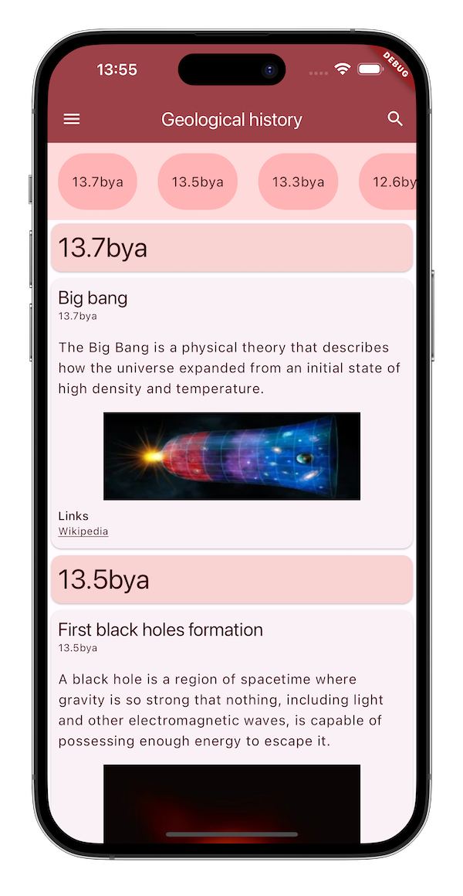
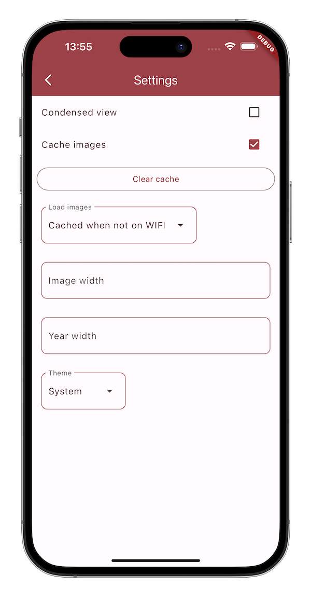
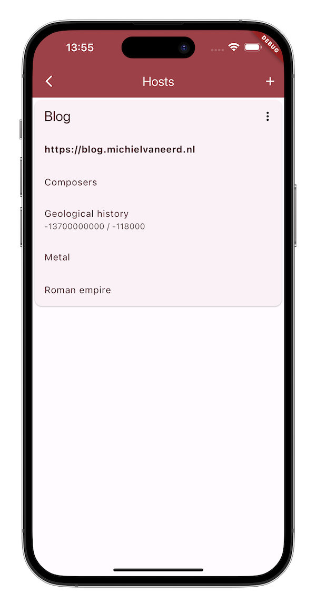

# Timeline

A Flutter app that displays timelines that can be created by an accompanying [Wordpress plugin](https://github.com/michielvaneerd/timeline-wp-plugin).

The idea is that you create timelines in the Wordpress plugin and display them in the app. You can add multiple hosts that provide timelines and you merge multiple timelines from different hosts to display in the app.

## Screens

### Timeline items

### Timeline settings

### Timeline hosts

